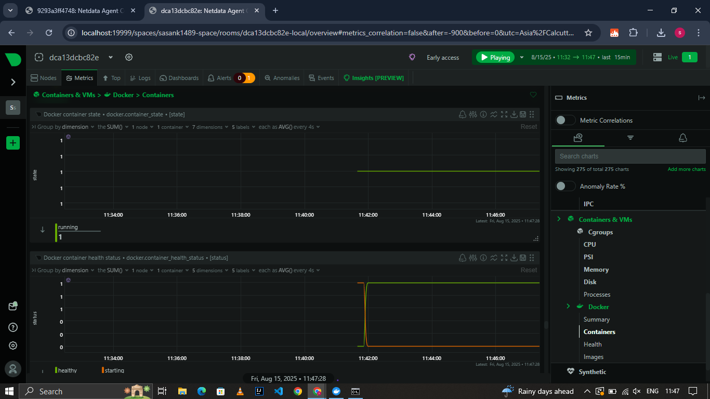
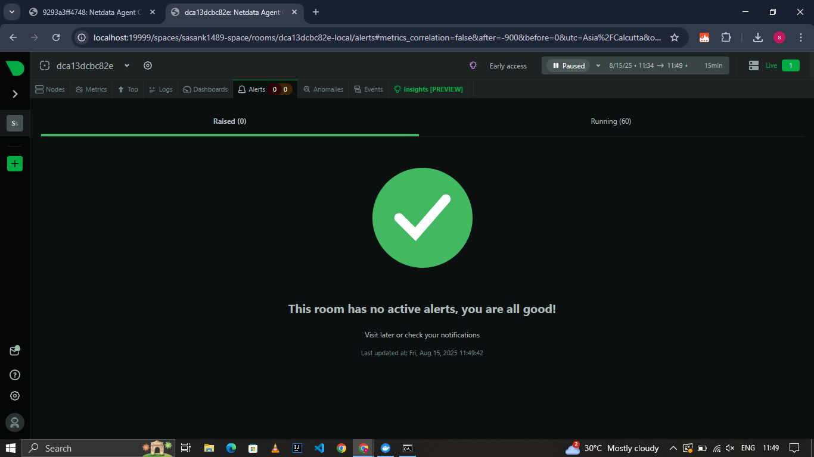

# **Netdata System Monitoring**

This project demonstrates the installation and usage of **Netdata** for real-time monitoring of system resources such as CPU, memory, disks, containers, and alerts.

---

## **Steps to Run Netdata in Docker**

1. **Pull the Netdata Docker image**  
   ```bash
   docker pull netdata/netdata
   ```

2. **Run Netdata with necessary permissions**  
   ```bash
   docker run -d --name=netdata \
     -p 19999:19999 \
     --cap-add SYS_PTRACE \
     --security-opt apparmor=unconfined \
     -v /etc/passwd:/host/etc/passwd:ro \
     -v /etc/group:/host/etc/group:ro \
     -v /proc:/host/proc:ro \
     -v /sys:/host/sys:ro \
     -v /var/run/docker.sock:/var/run/docker.sock:ro \
     -v /var/log:/var/log:ro \
     netdata/netdata
   ```

3. **Check if the container is running**
   ```bash
   docker ps
   ```

4. **Access Netdata Dashboard**  
   Open your browser and go to:
   ```
   http://localhost:19999
   ```

---

## **Dashboard Screenshots**

### **Metrics Overview**


### **Memory Usage**


### **Disk Usage**


### **Containers Monitoring**


### **Alerts**


---

## **Features**
- Real-time monitoring
- Low-resource consumption
- Containerized setup
- Alerts and notifications

---

## **Stopping the Container**
```bash
docker stop netdata
docker rm netdata
```
